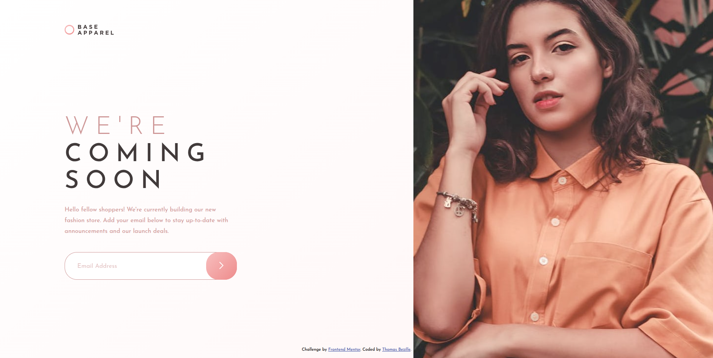
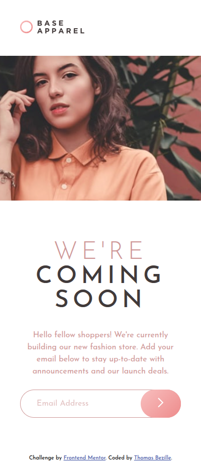

# Base Apparel coming soon page

> Une page « coming soon » responsive avec un formulaire d'inscription par email, dont la saisie est validée en temps réel pour informer l'utilisateur en cas d'adresse invalide.




**🔗 [Demo en ligne](https://front-end-mentor-base-apparel-comin.vercel.app/)**

---

## 🎯 Objectif

Ce projet est une solution au challenge « Base Apparel coming soon page » proposé par Frontend Mentor. L'objectif était de reproduire fidèlement une maquette tout en gérant la validation d'un formulaire côté client. J'ai souhaité y pratiquer une approche mobile-first, une architecture SCSS structurée et la validation d'email typée avec TypeScript.

**Ce que j'ai appris :**

- HTML sémantique : structuration claire et accessible du contenu
- CSS / SCSS : approche mobile-first, variables, nesting et organisation en partials
- Responsive design : adaptation des layouts mobile et desktop via les media queries
- TypeScript : manipulation typée du DOM et gestion des événements
- Validation de formulaire : vérification du format de l'email via une expression régulière personnalisée
- Workflow npm : compilation du SCSS via des scripts dédiés
- Git : versionnement structuré avec la convention Conventional Commits

---

## 🛠️ Stack


---

## 🚀 Lancer le projet

## 🚀 Installation

### Prérequis

- [Node.js](https://nodejs.org/) (version 18 ou supérieure recommandée)
- L'extension [Live Server](https://marketplace.visualstudio.com/items?itemName=ritwickdey.LiveServer) pour VS Code

### Étapes

1. **Cloner le dépôt**

```bash
   git clone https://github.com/Thomas-Bezille/FrontEnd-Mentor_Base_Apparel_coming_soon_page.git
   cd FrontEnd-Mentor_Base_Apparel_coming_soon_page
```

2. **Installer les dépendances**

```bash
   npm install
```

3. **Lancer la compilation du SCSS en mode watch**

```bash
   npm run sass
```

> Cette commande surveille et compile automatiquement les fichiers SCSS à chaque modification.

4. **Démarrer le projet**

   Ouvre le fichier `index.html` avec **Live Server** (clic droit → _Open with Live Server_) pour visualiser le projet dans ton navigateur avec rechargement automatique.

---

## 👤 Contact

**Thomas Bezille** — Développeur web à Nantes

[](https://www.linkedin.com/in/thomas-bezille/)
[](https://github.com/Thomas-Bezille)
